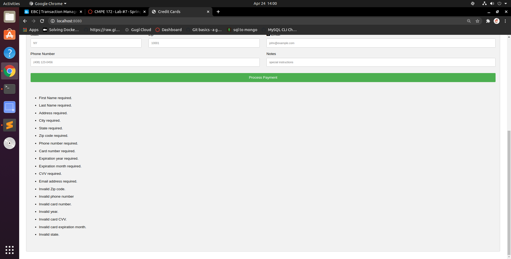
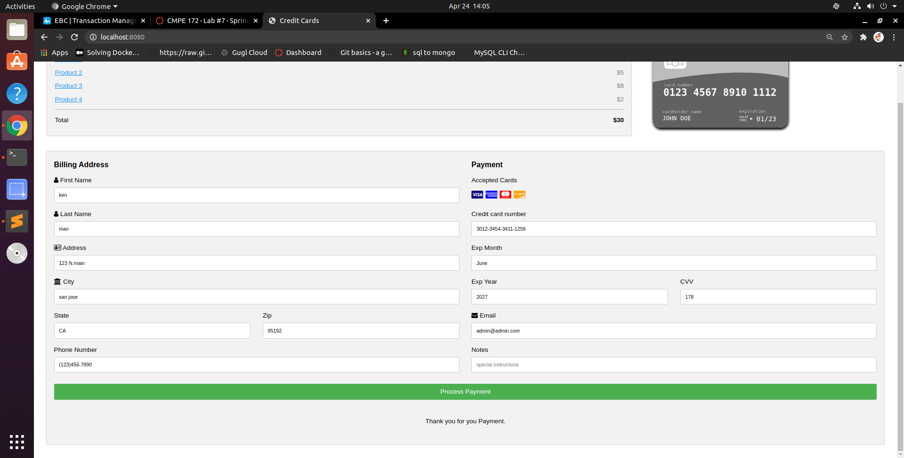
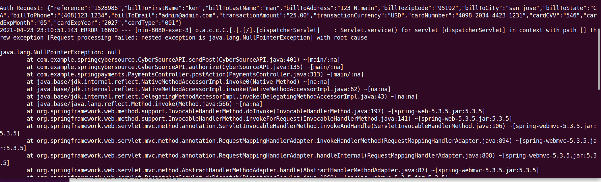
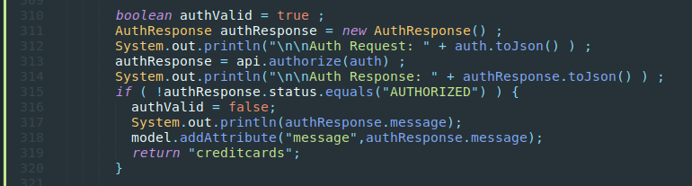

# CMPE 172 - Lab #7 - Spring Payments

## Screenshot of Validation and Payment

# Lab Notes

## Issues

In this lab, I am not able to complete the payment with E2E. 
The issue I was running into is that a nullpointer exception happened everytime when authorizing the payment request. The snapshots of the error and code block are shown below. Even though I borrow the code from the cybersource application to authorize a customize payment, the issue still remain. I also tried follow what professor had done in the demo but still failed to resolve the issue. 

1.Discussion of the Lombok, ThymeLeaf and Spring Features you used in this Lab.
The Lombok used in this lab is mainly to use the @Getter and @Setter annotation to generate getter and setter method for the model objects. Using ThymeLeaf, I can map the html input field to the spring model and process the input data with the controller. 

2.Discuss why Jackson is needed and where it is used in the code for this Lab.
Json is used in the Payload class in springcybersource to convert the java obeject in the request model to the Json format. It's also used inside the cybersource api to convert the text response from cybersource to a java object. 