# CMPE 172 - Lab #1 - Hello Spring

## Part 1 - Spring Demo App

### Using Spring Initializr.

Scree shot of the browser:

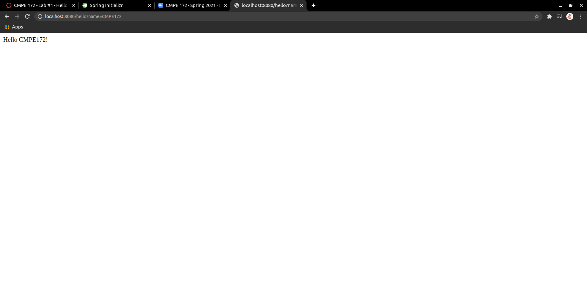
 

Scree shot of desktop:

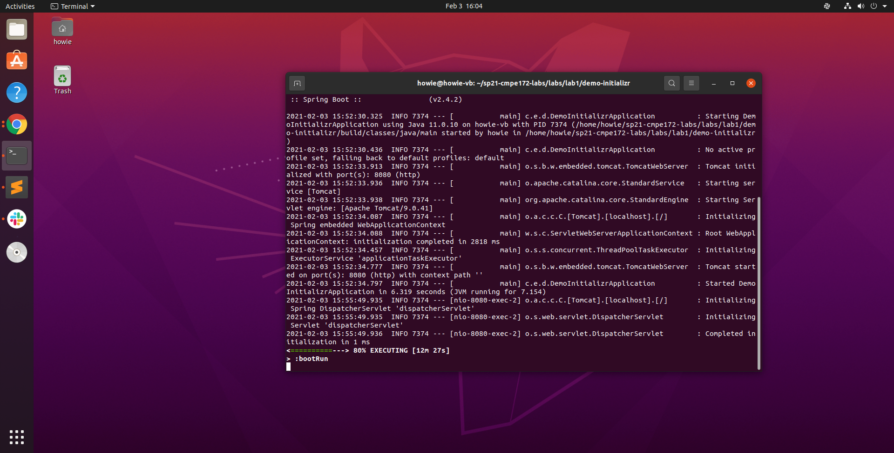
 

### Using VS cod.

Screen shot of the browser:

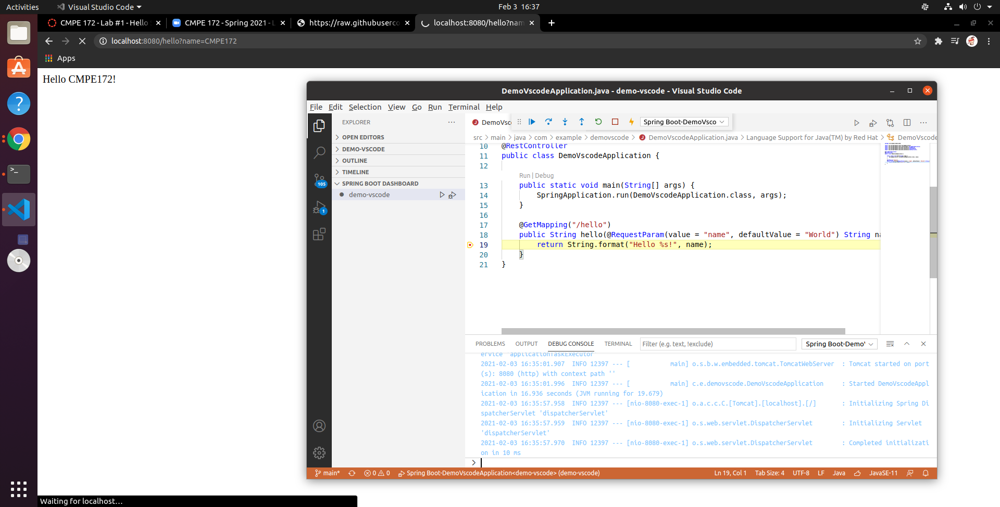
 

Screen shot of desktop:

 
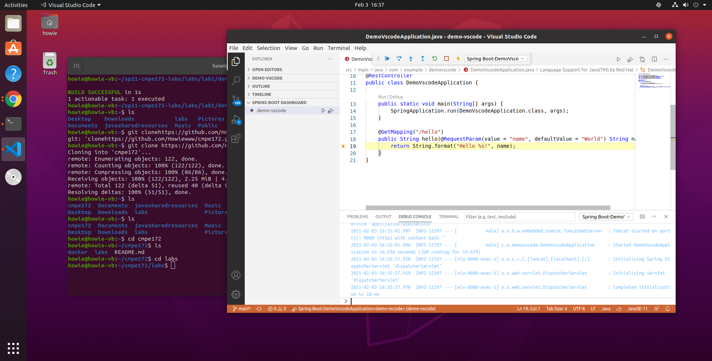

### Spring Demo App Configured for Docker and Kubernettes

Screen shot of the Sring Boot App docker image and the container:

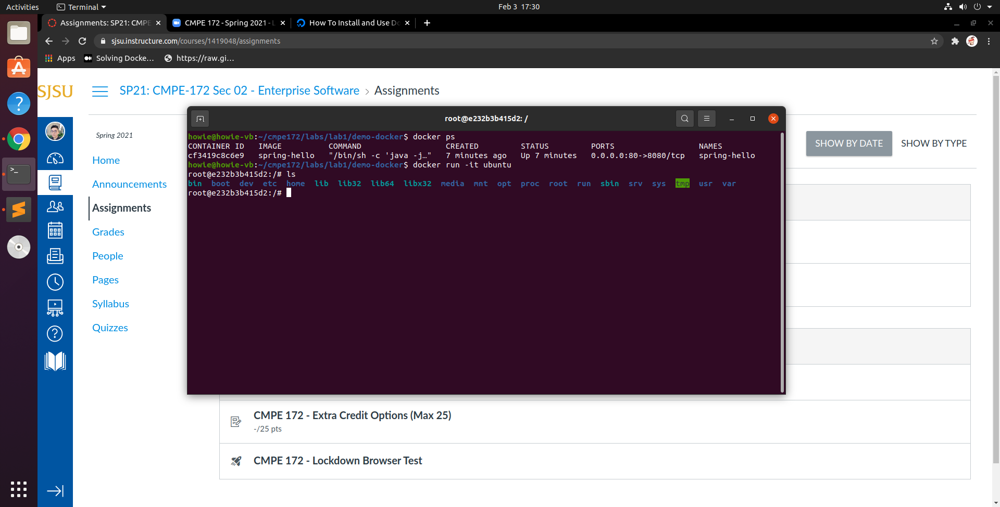

 

Screen shot for deploying the Spring Boot App to Kubernettes:

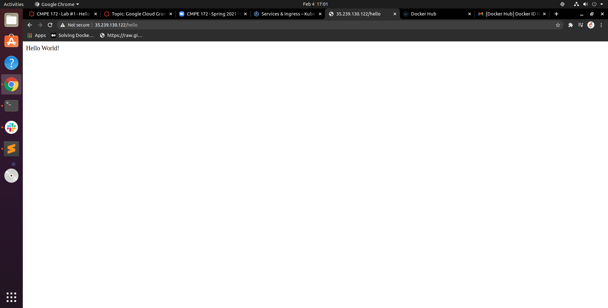

 

## Part 2 - Tacos-cloud 

### Deploy Tacos-cloud App to Google Cloud Platform

Screen shot of browser of Tacos Cloud App:

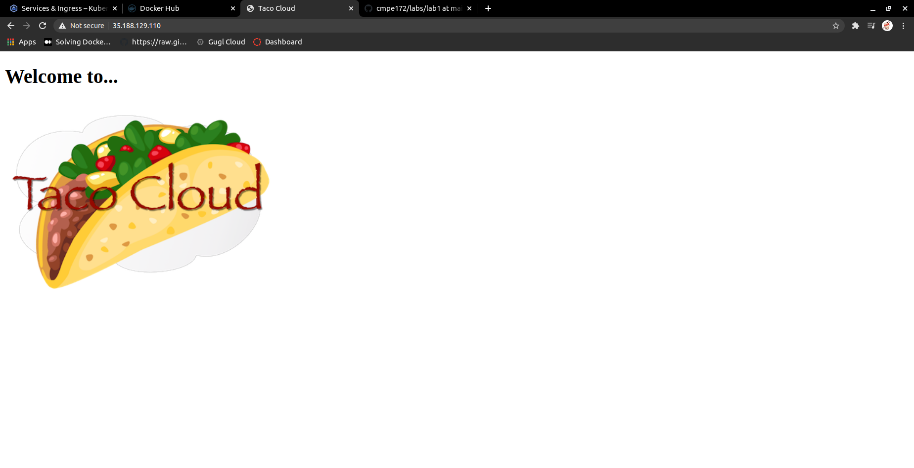

Screen shot of the Tacos Cloud Service: 

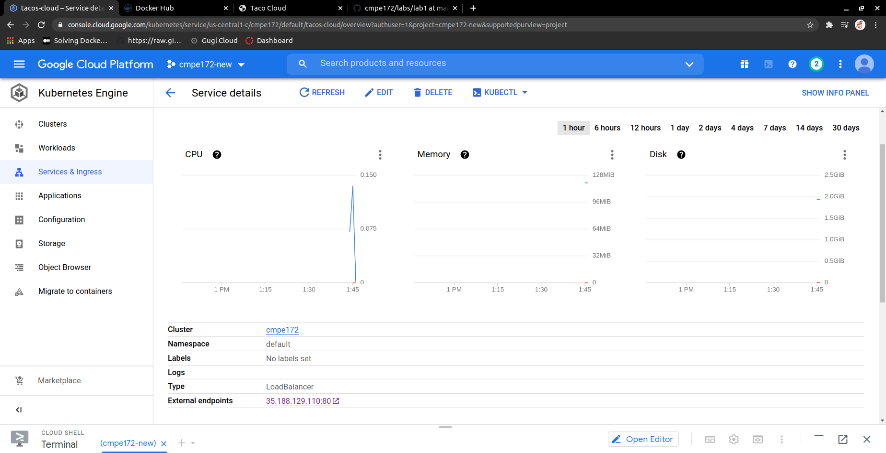

Screen shot of the Tacos Cloud Pod Workload:

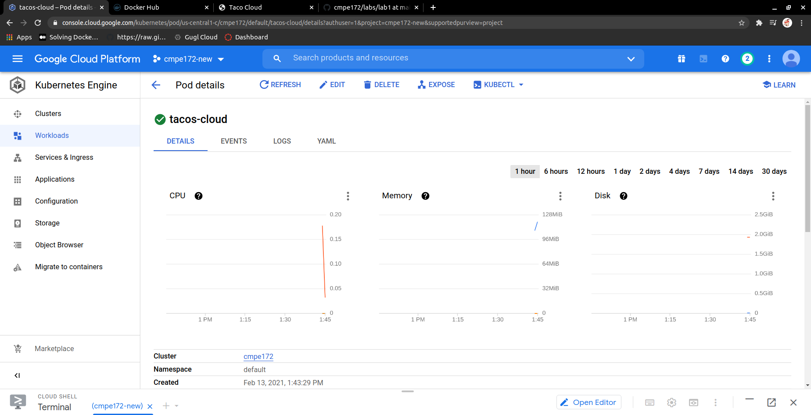

# Lab Notes

## Error 1

 A problem encountered while using command: "make docker-build", gradle build stuck at HomePageBrowserTest. 

## Solution

Fix the issue by modifying the Makefile on "compile": 

compile:
	gradle build -x test

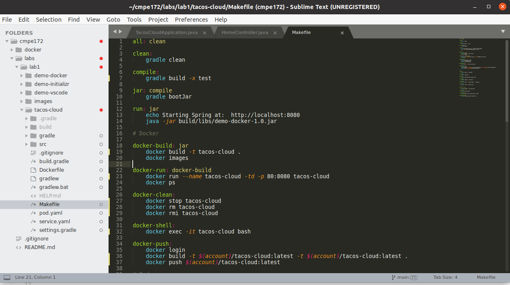

## Error 2

The docker jar file not found since the old Dockerfile specify the old path to the demo-docker jar file. 

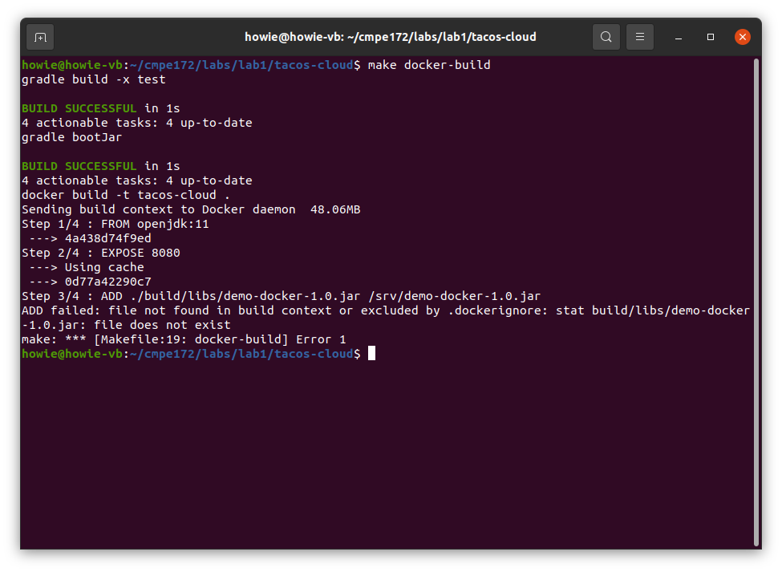

## Solution

Modify the Dockerfile to specify the new path points to the taco-cloud docker jar file. 

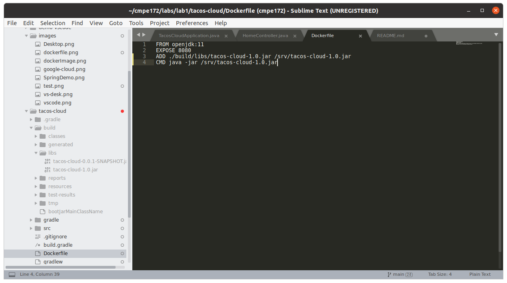

