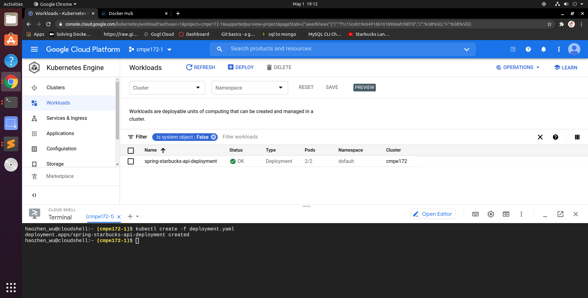
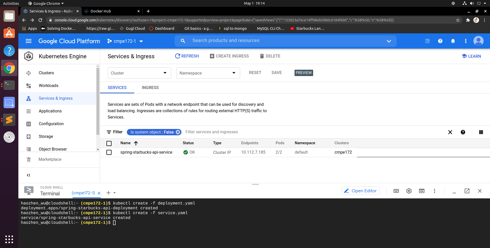
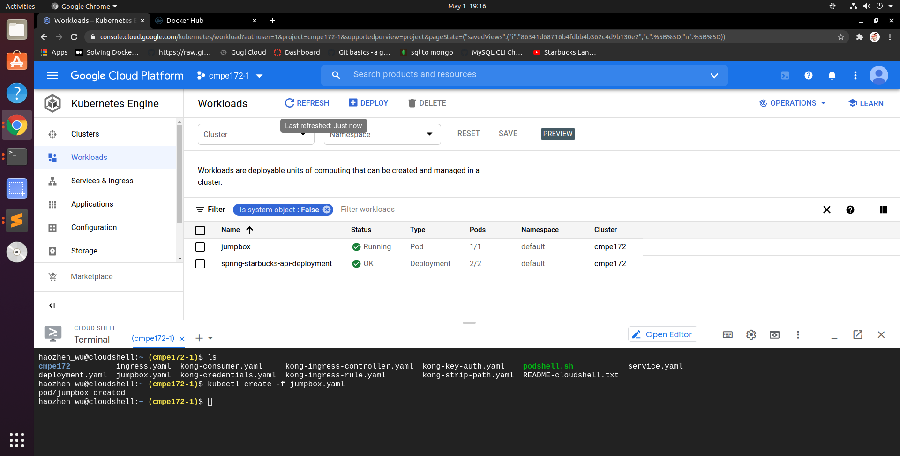
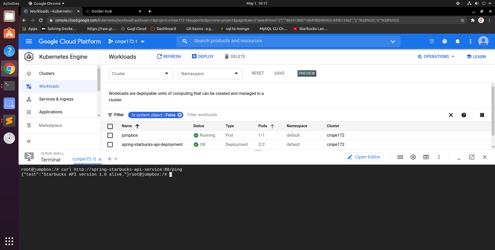
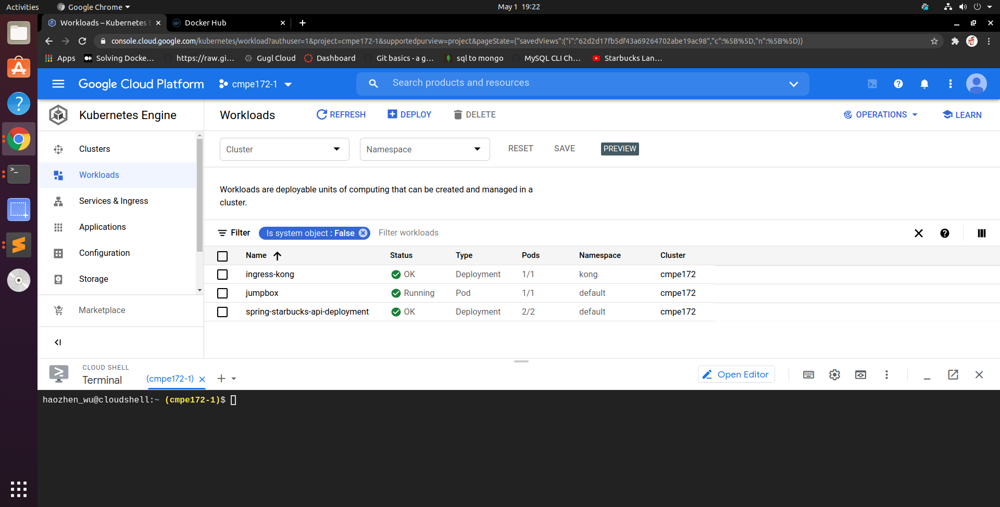
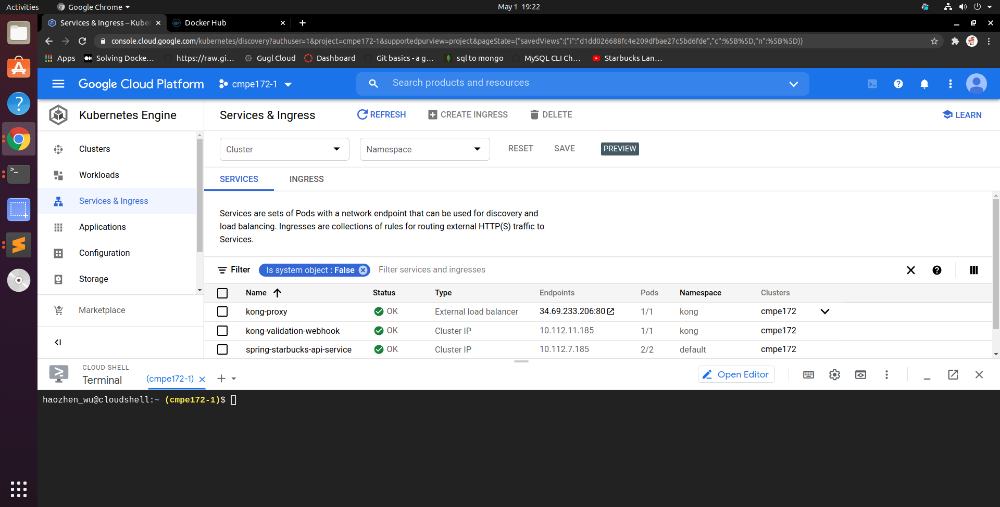
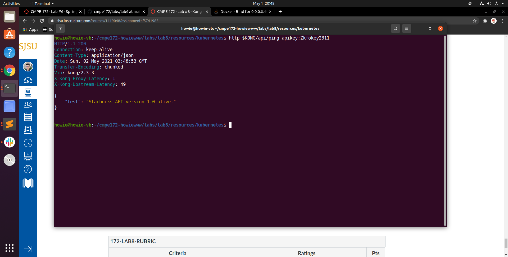
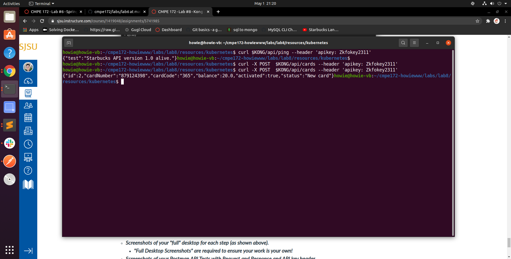
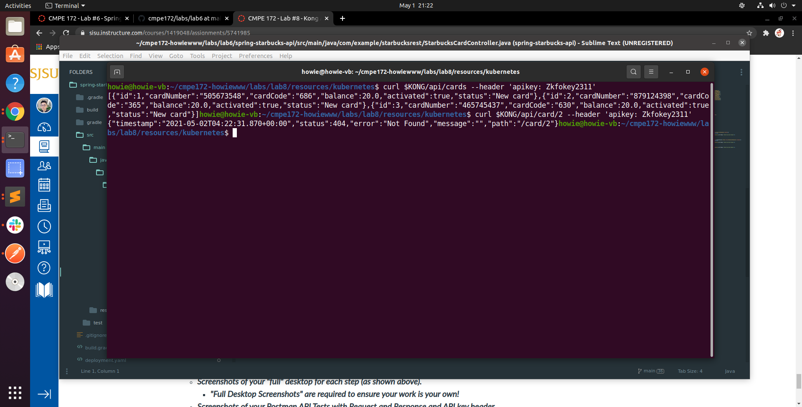
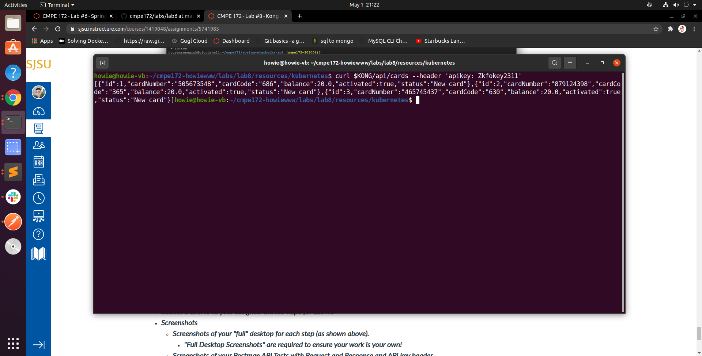

# CMPE 172 - Lab #8 - Kong API Gateway

## Deployment to GKE

* Workloads

* Services 

* jumpbox

* Kong Gateway Set Up

## Requests and Responds through KONG using CURL

* Ping 

* Create a new card

* display one card

* display all cards 

## Challanges 

The only issue I have encountered is that the starbucks-api docker image is not running since I deployed the API with MySQL. There is a connection failure with the MySQL database even though the service is online. I fixed the issue by deploying the API using H2 database. Another issue is that the starbucks api I created in lab#6 is not complete, so I wouldn't be able to test the API throughly.

To deploy the Starbucks API with MySQL, the application properties need to be changed to be able to connect to the database, for instance, the user name and database name must be specified in the properties.  