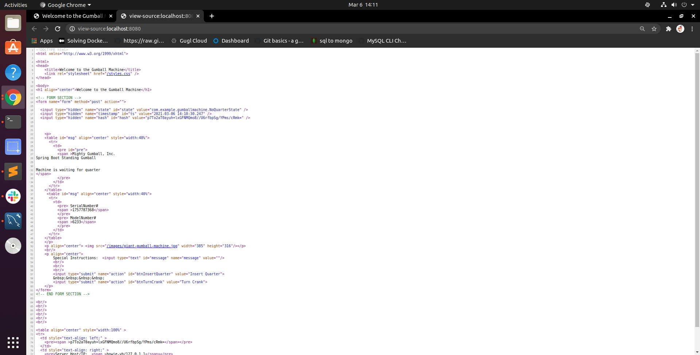
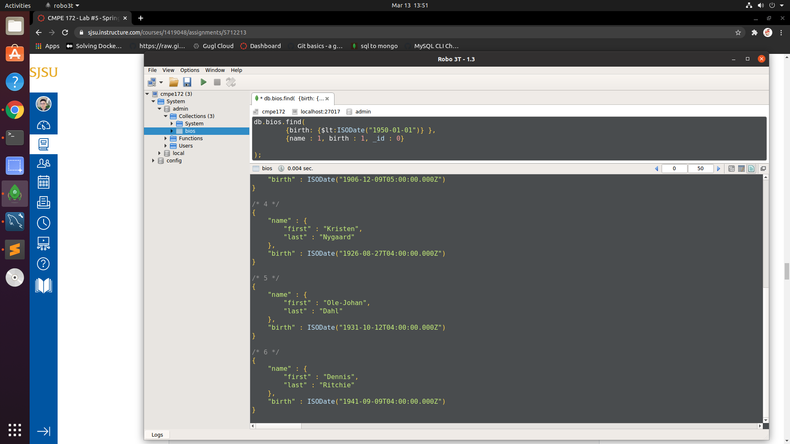

# Lab #5 - Spring Data

 
# Spring JDBC

* Screenshot of spring-jdc on console


## Discussion


As we can see from the output of the console, using the jdbcTemplate we are able to create tables and inserting those customers' information into the table. 


# Spring MySQL

* Screenshot of spring-mysql running on localhost


## Discussionn

Using the addNewUser method in the controller of the spring-mysql, we can specify the path and use "/add" to add a new user to the data. We can also speicify the path to be "/all" to display all the information. 


# Spring Gumball -- V3

* Screenshot of web running spring gumball-v3


* Page source 



* Screenshot of docker deployment


* Database before turning crank


* Database after turning crank showing decreasing count


## Discussion

The screenshots above were taken before the modification of the code. After modyfiying the code, I was still not able to deploy the gumball v-3 to the docker using the new hints on canvas. However, I have implemented the features of displaying the searial and model number on webpage and the deduction of gumball-counts on mysql database(as shown on the able screenshots). 


# Screenshots of Query output

1 - Count of Records/Documents

```
select count(*) from person

```


2 - Find Bios with Birth Date before 1950

```
select first_name, last_name, birth_date 
from person
where birth_date < date('1950-01-01')
```





3 - Get a Unique Listing of all the Awards (in DB/Collection) granted

```
select distinct(a.award_name)
from person_awards pa, awards a
where pa.award_id = a.award_id3
```


4 - Get a Sorted Listing of all the First Names (ascending order)

```
select first_name
from person
order by 1
```


5 - Get a Sorted Listing of all the First Names (descending order)

```
select first_name
from person
order by 1 desc
```


6 - Count the number of BIOS that don't yet have an award

```
select count(*) from person p
where not exists 
    (select 1 from person_awards 
     where person_id = p.person_id)
```


7 - Display the System ID (Primary Key) for the BIO in Query #6

```
select p.person_id from person p
where not exists 
  (select 1 from person_awards 
   where person_id = p.person_id)
```


8. Display names (first and last) along with awards and contributions from BIOS with 1 Contribution AND 2 Awards

```
select p.first_name, p.last_name, c.contribution, a.award_name
from person p, person_awards pa, awards a, contribs c
where p.person_id = c.person_id
and p.person_id = pa.person_id
and pa.award_id = a.award_id
and  (select count(*) from contribs c where c.person_id = p.person_id) = 1
and (select count(*) from person_awards pa where pa.person_id = p.person_id) = 2
```


9. Display names (first and last) along with awards and contributions from BIOS with 1 Contributions OR 2 Awards

```
select p.first_name, p.last_name, c.contribution, a.award_name
from person p
left join contribs c using (person_id)
left join person_awards pa using (person_id)
left join awards a using (award_id)
where (select count(*) from contribs c where c.person_id = p.person_id) = 1
or (select count(*) from person_awards pa where pa.person_id = p.person_id) = 2
```


10 - List all the Awards for a BIO

```
select p.first_name, p.last_name, a.award_name
from awards a, person_awards pa, person p
where a.award_id = pa.award_id
and p.person_id = pa.person_id
and p.person_id = 1
```


