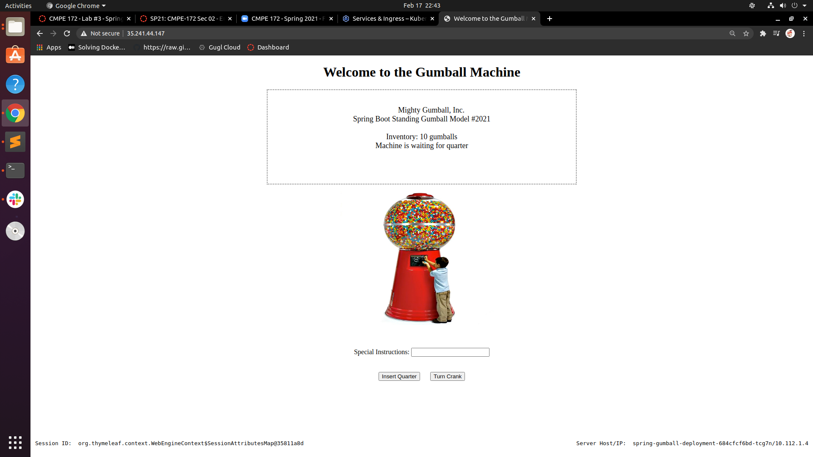
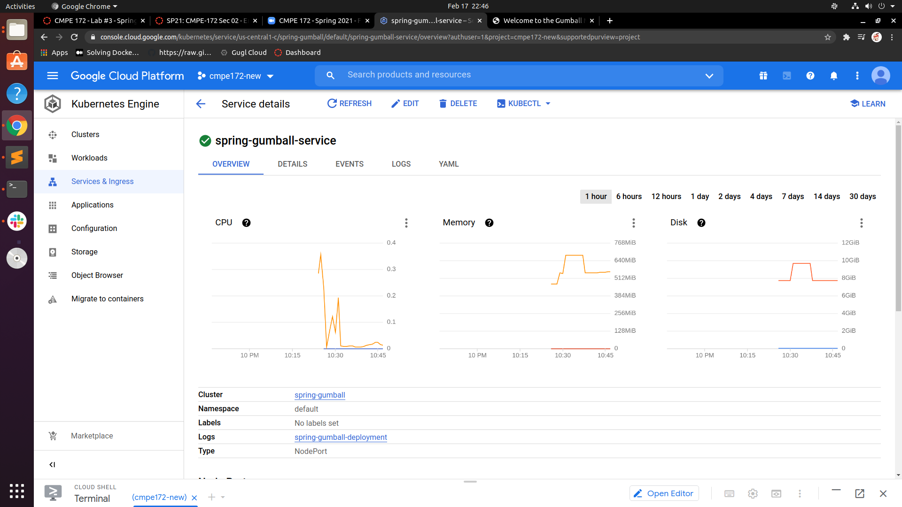

# CMPE 172 - Lab #3 Spring Gumball 


## Part 1 -- Spring Gumball on Docker

*Screenshots of deployment to Docker via Docker Compose*


*Screenshots of Gumball App Running*


1. When you load the page multiple times what do you see on the Gumball Home Pages for Server Host/IP?

There are two different Server Host/IPs when load the page multuple times.

2. Can you explain where that IP value comes from?

The diffrent IP value may come from the proxy server since it acts as a gateway between the host and server. It hides the host IP address and expose another IP address to the public network. 

3. Do you see the inventory depleting?  Are there any errors?

There is a Whitelabel Error when I try to add some quarters. The error is a nullpointer exception by looking at the logs of the spring boot. It's caused by the controller when it tries to call the turncrank method of the object gm(gummachine). The reason is that the service is switching between two different pods. An gm object might created in pod 1,but it's not at pod 2 when the controller tries to refer to it again. 


4. Is there a setting that can avoid the error?  Why does it work (or Why not).

After making the "COOKIES_ENABLED" session to be true on docker-compose.yaml file, the erorr is avoided. I think it works because this option enables the cookie-based session of the haproxy. It remembers the state of each requests from the host through cookies. Thus, when switching from different pods, the state of the objects is preserved.


## Part 2 -- Spring Gumball on GCK


*Screenshots of the deployment to Google Cloud*



*deployment*


*service*




*Ingress*


1. When you load the page multiple times what do you see on the Gumball Home Pages for Server Host/IP?

The Server Host/IP addresses changed while I load the page mutiple times.

2. Can you explain where that IP value comes from?

The different IP value may come from different pods on the GCK.

3. Do you see the inventory depleting?  Are there any errors?

By checking the log on the service, 

```"java.lang.NullPointerException: null at com.example.springgumball.GumballMachineController.postAction". ```

A same error occured as the deloyment on docker.

4. Is there a feature in GCP Load Balancer and/or GKE that can resovle the error? 

Fixed the error by changing the session affinity to "Gnerated Cookie"of the backend service in the ingress section. 
 
### Jumpbox testing

*Screenshot of gumball running inside jumpbox*


*Refreshing inside jumpbox*


