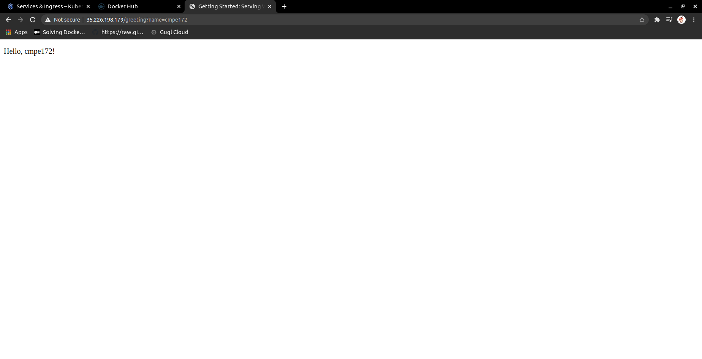

# CMPE 172 - Lab #2 - Spring MVC

## Part 1 -- Spring MVC and Spring Testing

### 1 -- Spring MVC

Screenshot of the browser:

Screenshot of the desktop:

### 2 -- Spring Test

Screenshot of the test report:

Screenshot of the desktop:

### 3 -- Spring Lombok

*ValAndVarUserDemo.print();*

a) In the @Val and @Var, the type of the variable will be inferred from the initializer expression. 
b) As we can see in the running output,"userName" modified by val method is the type of stringl;and "money" modified by var is the type of bigdecimal. 

*FieldLevelGetterSetterDemo.print();*

a) It generates field level getters and setters for the private fields.
b) As an example, we have a private field userName is annotated with bot @Getter and @Setter, a setter is generated "public void com.example.springlombok.FieldLevelGetterSetterDemo.setUserName(java.lang.String)", and a getter "public java.lang.String com.example.springlombok.FieldLevelGetterSetterDemo.getUserName()".

*ConstructorUserDemo.print();*

a) @NoArgsConstructor generates a constructor with none param, @AllArgsConstructor generates a constructor with 1 param. 
b) In the otput,I really can't tell if I saw it generates a constructor for userName, userId,and userAge. What confused me is that the code I copy from Canvas is very similar to the one of FieldLeveGetterSetter. Both of them generates the fields and methods. 

*DataUserDemo.print();*

a) The @Data annotation combines all features of @ToString, @EqualsAndHashCode, @Getter, @Setter, @RequiredArgsConstructo. 
b) As we can see from the output, there are getters and setters of all the variable. There is also a ToString method that shows the features of @Data is tested.

*NonNullUserDemo.print();*

a)@NonNull generates a null check for the annotated params of a method or a constructor.
b)In the running output, lombok detects that "userName" is annotated with non-null but end up being null.

*GetterSetterUserDemo.print();*

a)@Getter and @Setter annotations generate getter and setter for all fields when it's at class level.
b)In the original code, the whole demo class is annotated with both annotations, so in the output we have setter and getter for all fields in the class. 

## Part 2 -- Tacos Cloud App (Version 2)

1.The Tacos Cloud Pod Workload

2.The Tacos Cloud Service 

3.Browser Showing Tacos Cloud App Running

### Issue Encountered 

When I try to do gradle build for Tacos Cloud app, compile errors indicate that the javax.validation package is missing. 

I find a solution here [Validation Starter](https://github.com/spring-projects/spring-boot/wiki/Spring-Boot-2.3-Release-Notes#validation-starter-no-longer-included-in-web-starters). The reason is that validation starter no longer included in web starters, we need to manually add it as a dependency to the build.gradle file.

