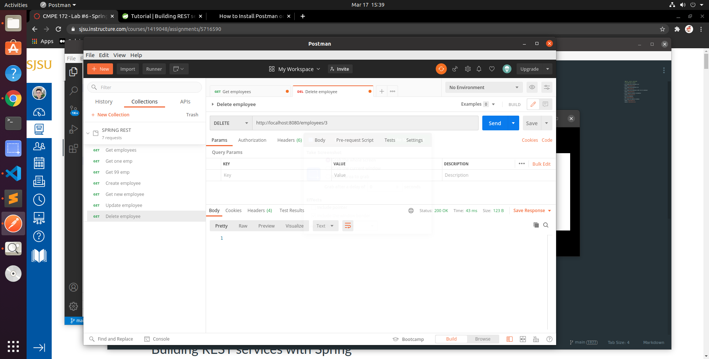

# CMPE 172 - Lab #6 - Spring REST

## Spring-REST API on Postman

1. Get request for all employees on db

2. Get request for #1 employees on db

3. Get request for #? employees on db(? = id of an employee)

4. Post request for creating a new employee

5. Get the new employee 

6. Put request for updating an employee

7. Delete request for deletingf an employee

## Starbucks REST API 

1. Get request for ping

2. Post request for creating a new card

3. Get request for the new card

4. Get request for an invalid card

5. Post request to activate the new card

6. Get request for all cards

7. Post request to create a new order

8. Delete request to clear the order

9. Post request to pay fot the order

10. Get request for all orders

11. Delete request to clear all cards

12. Delete request to clear all orders

