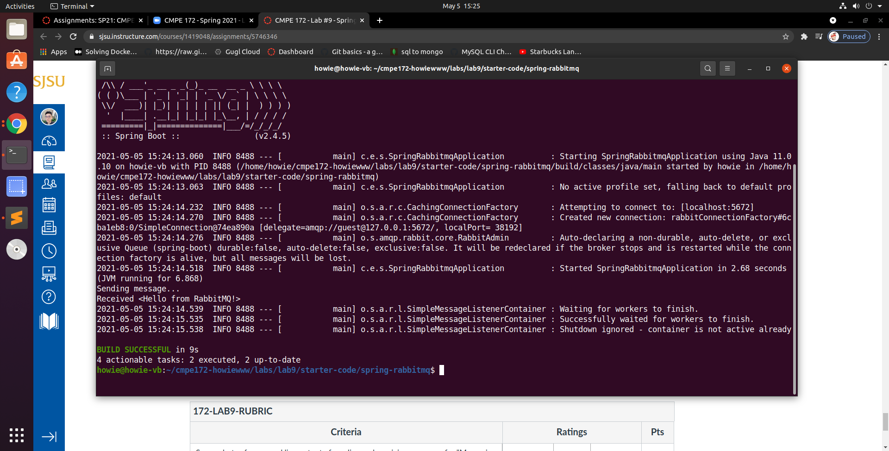
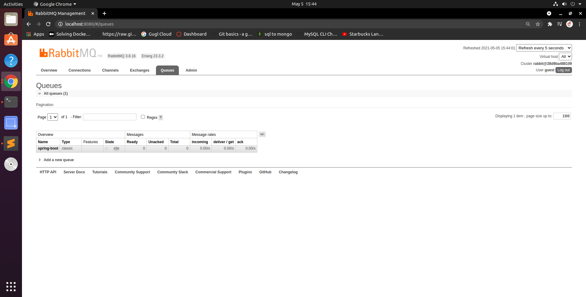
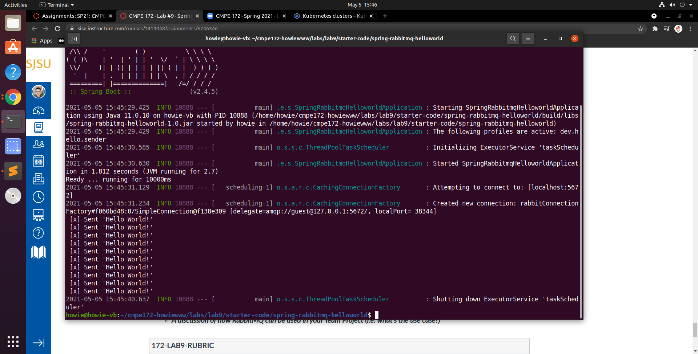
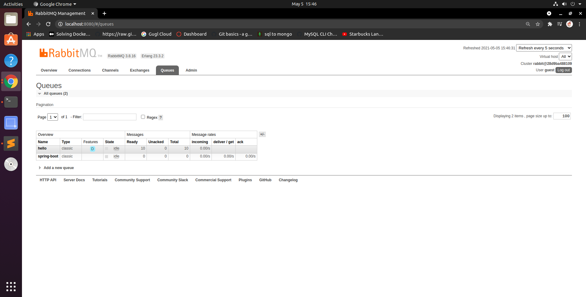
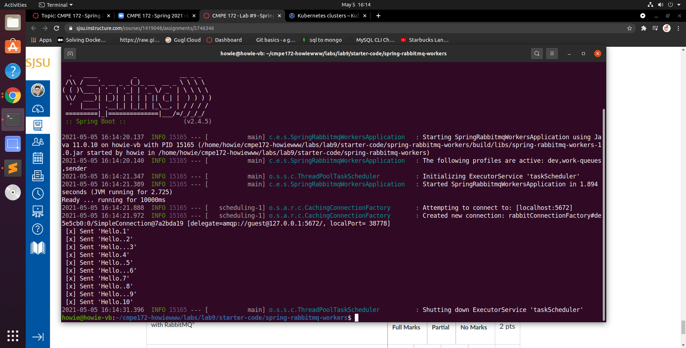
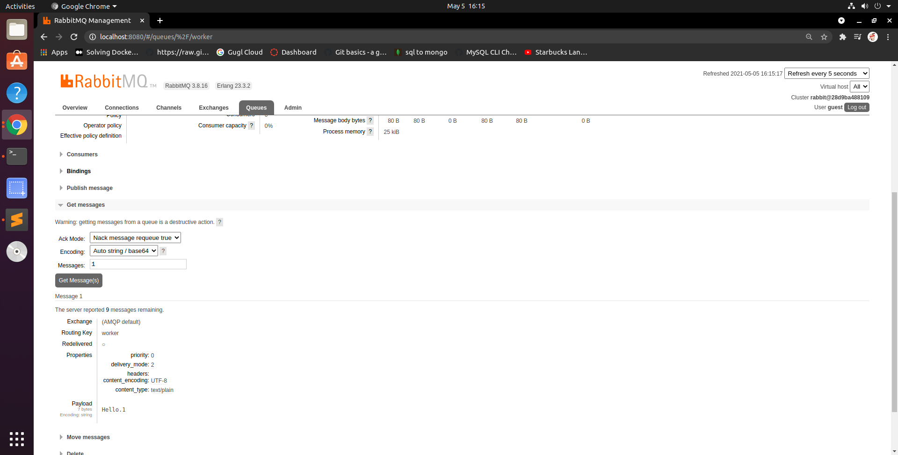

# CMPE 172 - Lab #9 - Spring RabbitMQ

## Messaging with RabbitMQ

* Screenshots of command line output of sending and receiving messages

* Screenshots of rabbitmq console

## RabbitMQ Tutorial - Hello World

* Screenshots of command line output of sending messages

* Screenshots of RabbitMQ Console with a sample of getting one message from the Queue

* Screenshots of command line output of receving messages

## RabbitMQ Tutorial - Work Queues

* Screenshots of command line output of sending messages

* Screenshots of RabbitMQ Console with a sample of getting one message

* Screenshots of command line output of receving messages

## Discussion

The spring profiles allow us to map the beans to different profiles, then we can activate different profiles in different environments to bootstrap only the beans we need. 

The spring profiles will be useful when we configure the database during different phases, such as development and test. We might have different database configuration in thoes two phases, but we can use the spring profiles to control the db configuration bean. 

The RabbitMQ can be used in add payment method when users want to add a new card. For instance, multiple users are trying to add a new card, and to prevent heavy workloads, we can use the rabbitMQ to queue the customers new payment information that to be processed later. 