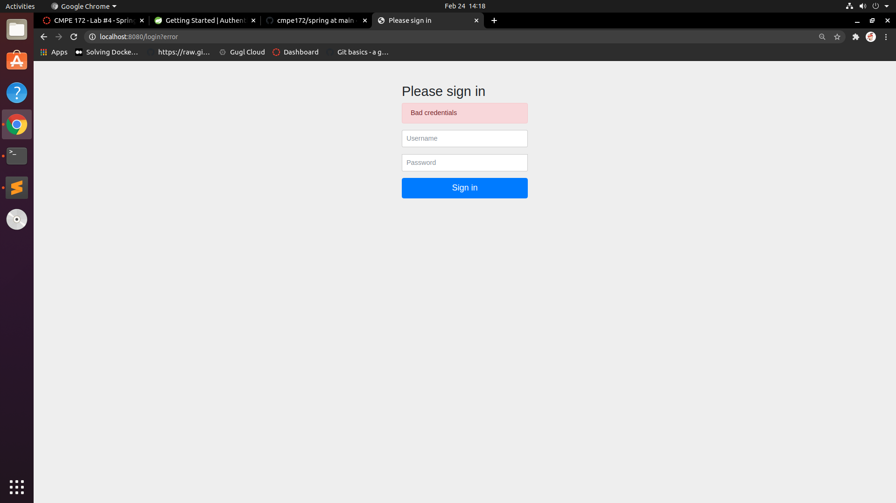
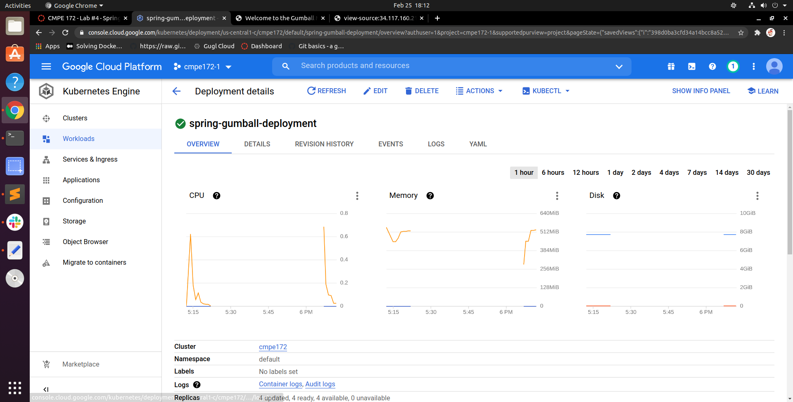
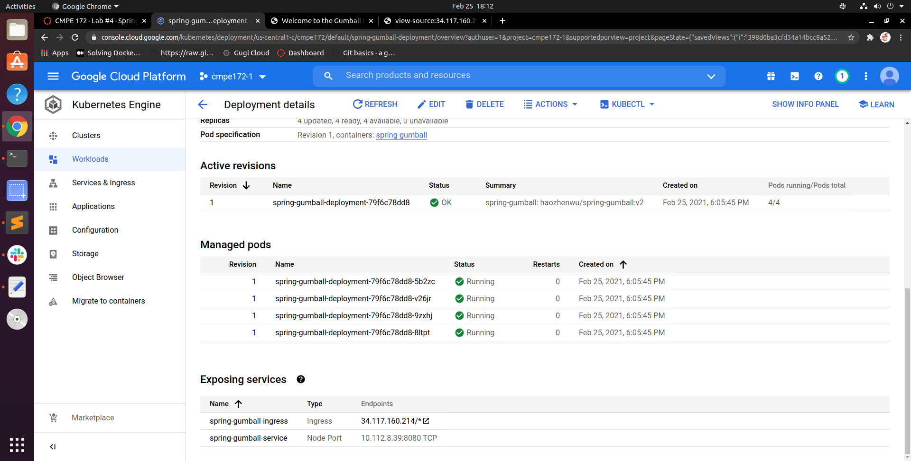
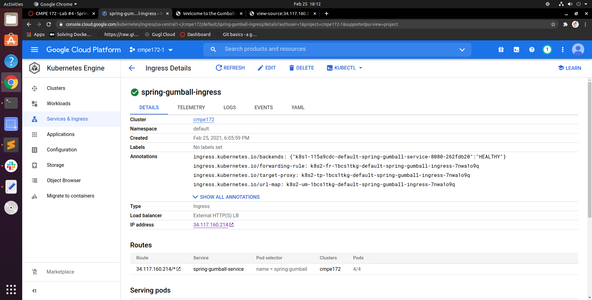
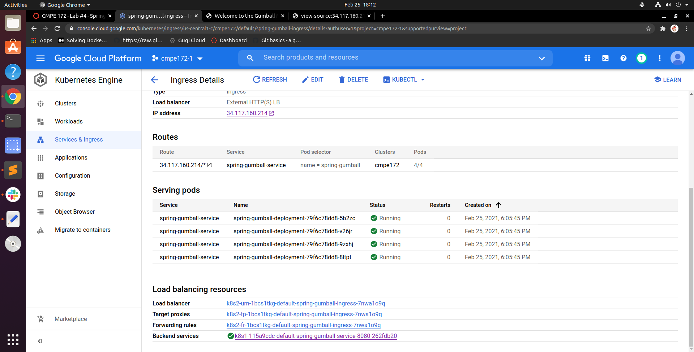
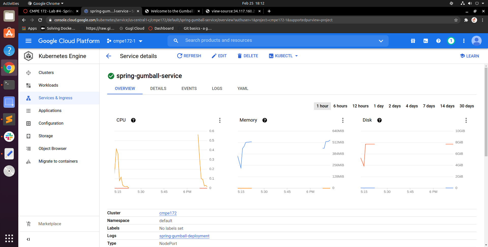
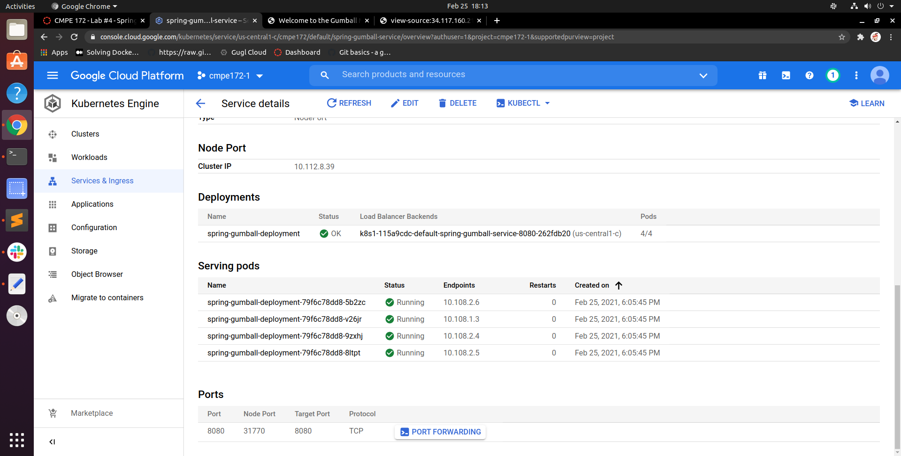
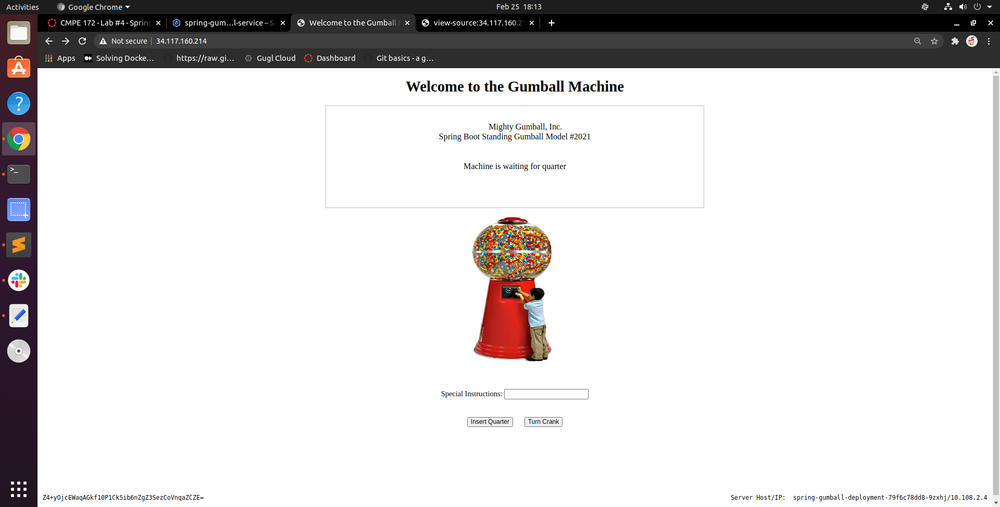
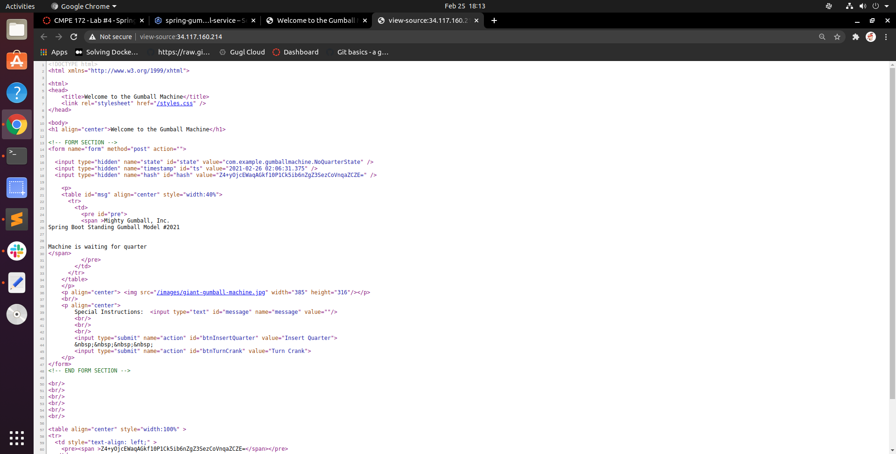

# CMPE 172 - Lab #4 -Spring Security & Spring Gumball (Version 2)

## Spring LDAP

*Screenshot of the login page of LDAP*

*Screenshot of the welcome page*

### Disscussion

By using the LADP test user's credential, I am able to login successfully. However,when I try to login with another test user's credential in LDIF file, it failed to login successfully. Then I modified the springLDAP test and the ldapAuthentication() method to have the method serach for bob in the LDAP server(uid ={1}). It thwors asserrtion error when I did  gradle build, and I couldn't figure out how to fix the error.

## Spring Security

*Screenshot of home page*

*Screenshot of login page*

*Screenshot of hello page*

### Disscussion

When click "here" to get into the login page and without entering credential information, the security filter would not authenticate a user to access the greeting page. After login with the correct user credential, I can then view the greeting page. The application is sent back to the login page when I logout. 

## Spring Gumball (Version 2)

*Deployment details*

*Ingress*

*Service*

*Gumball v2 running on GCK*

*Hidden field(state,timestamp,hash)*

### Disscussion

Q: Do you see any errors that were observerd in Spring Gumball (Version 1)? Why or Why Not? 

Yes, there is the same NullPointerException error that were in version 1. The reason is that the application is deploying to 4 different pods,and the state of the object might be different between different pods. The controller may point to the null gumball object at pod 2 but it originally expects the one at pod 1.